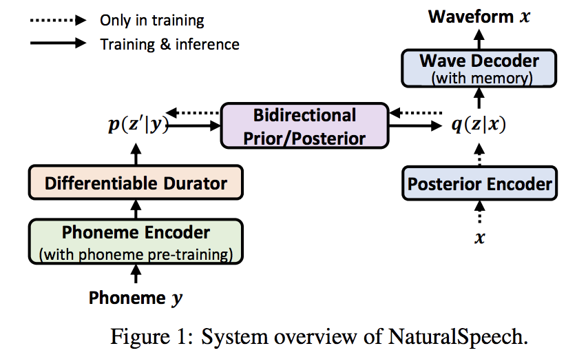

</img>

## Natural Speech - Pytorch (wip)

Implementation of the neural network proposed in <a href="https://arxiv.org/abs/2205.04421">Natural Speech</a>, a text-to-speech generator that is indistinguishable from human recordings for the first time. The novelty of the paper includes a differentiable duration predictor module, a bidirectional prior / posterior, as well as attending to a set of learned memories.

<a href="https://speechresearch.github.io/naturalspeech/">Audio samples from their project page</a>

## Citations

```bibtex
@misc{tan2022naturalspeech,
  title   = {NaturalSpeech: End-to-End Text to Speech Synthesis with Human-Level Quality}, 
  author  = {Xu Tan and Jiawei Chen and Haohe Liu and Jian Cong and Chen Zhang and Yanqing Liu and Xi Wang and Yichong Leng and Yuanhao Yi and Lei He and Frank Soong and Tao Qin and Sheng Zhao and Tie-Yan Liu},
  year    = {2022},
  eprint  = {2205.04421},
  archivePrefix = {arXiv},
  primaryClass = {eess.AS}
}
```
